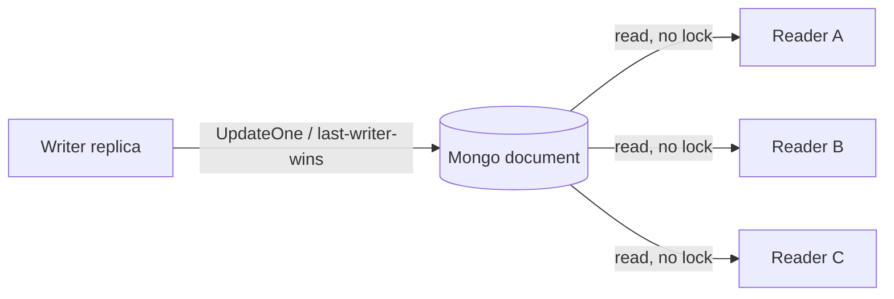
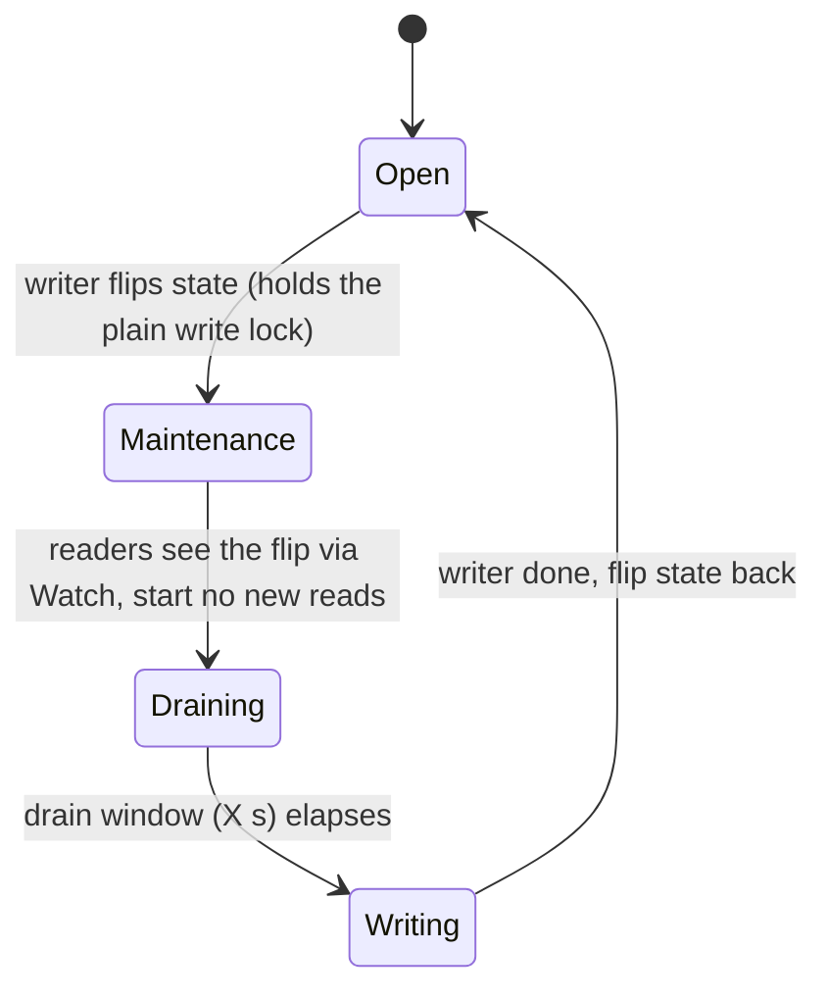
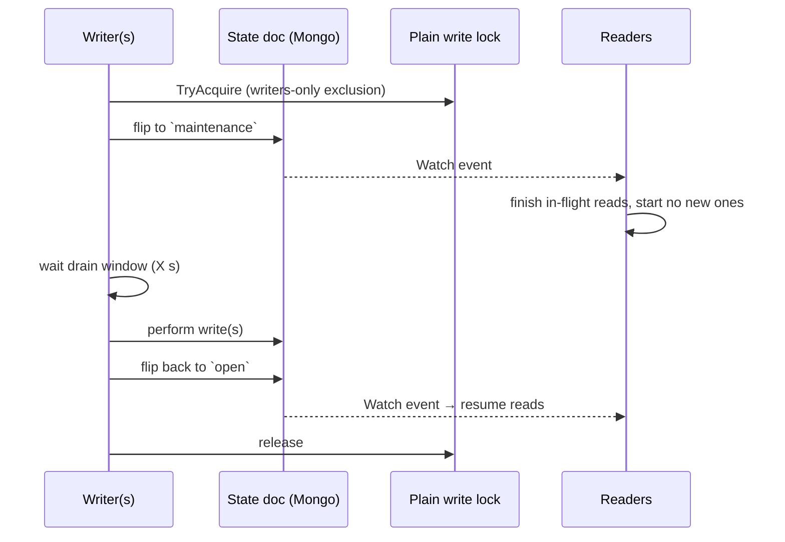

# Lock Infrastructure

While working with multi threaded programing, one heavily relies and make use
of mutex, to take a lock/ownership ensuring some sort of synchronization
construct between the different threads or go routines or concurrent tasks.
Which enables taking care of break condition between them ensuring no over
stepping between concurrent executors.

While there is nothing standard that exists providing the necessary
synchronization between different processes, running on same machine or
different. When working with kubernetes applications using microservices based
arhitecture, with horizontal scaling capabilities would be running multiple
instances of the same application, where each instance with same logic would
try to perform same kind of operations based on the events received, which
would required a mutex like construct to function across microservices for
synchronization between two different processes, possibly running on different
nodes of the kubernetes cluster

TODO(Prabhjot) insert a diagram of every process interacting with synchronizer

## Solution

As a base construct Database is one of the entity every process or microservice
instance interacts with, where Database ensures reliability, consistency as
part of its internal processes. While working with databases, it also ensures
for every entry written to it won't allow if a conflicting Key already exits in
the database, which provides the base fundamental construct needed for enabling
mutex functionality across process. Thus Database is a strong candidate that
provides the synchronizer contructs.

TODO(Prabhjot) insert a diagram of every process interacting with database as synchronizer

However, one of the basic implicit construct of mutex is being ephermal, so if
a process restarts the constructs of mutex is lost and everything will start
afresh but this becomes now tricky in case of database based entries as
whenever a process dies while holding a mutex or lock, someone needs to ensure
sanity of the system by identifying that the lock is held by a process which is
no longer active and thus clears it up allowing the continuity of operations

TODO(Prabhjot) add details of the lock owner handling details

## Waiting for a lock

`sync/` deliberately ships only a non-blocking `TryAcquire` (a duplicate-key
insert means the lock is already held, and the call returns immediately).
There is no blocking `Acquire`, and no fair/FIFO lock. The recommended way to
"wait for a lock" is to drive lock usage through the **reconciler** framework
rather than parking a goroutine on the lock:

1. Register your controller for lock-release notifications with
   `LockTable.RegisterLockRelease(name, ctrl)`. Register the *same* controller
   on your own domain table (via its reconciler `Manager`) so that normal data
   changes trigger it too.
2. In `Reconcile(key)`, **first check whether there is real work pending for
   that key**. Only if there is, call `TryAcquire`.
3. If the lock is held by another replica, just return. When the holder
   releases the lock, the release notification re-invokes `Reconcile(key)` and
   you re-evaluate whether work is still pending.

Gating acquisition on actual work is the important part: it avoids the endless
take-lock / find-nothing-to-do / release-lock churn that a naive
blocking-acquire loop would cause across N replicas, and it needs no new
primitive. Under contention only one replica wins `TryAcquire`; the rest do
nothing until the lock is released, at which point they re-check for work
before trying again.

(This work-gating applies to the *transient* variant, where the lock guards a
discrete task. When the lock is itself the ownership token — see *Variants of
the pattern* below — you instead acquire for any owned key and hold it, and the
same release notification hands the key to a surviving replica.)

See `sync/test/lockreconciler/example.go` for a complete, runnable example
built on the existing `reconciler` constructs.

## Variants of the pattern

The same reconciler-driven, lock-release re-drive shows up in a couple of
shapes, depending on what the lock represents:

- **Acquire-and-hold ownership (leader-ish).** The lock *is* the unit of
  ownership: a replica `TryAcquire`s a key and **holds** it for as long as it
  owns that key; a peer's release re-drives `Reconcile` so a surviving replica
  can take the key over. Because the lock is the ownership token, acquisition
  is *not* gated on pending work.
- **Work-gated transient lock.** The shape in the example below (and in the
  steps above): acquire only when there is real work for the key, release when
  done, and rely on the release notification to re-drive contenders. This
  avoids the take-lock / find-nothing / release-lock churn when the lock is
  *not* itself the ownership token.

A third, simpler variant skips `RegisterLockRelease` entirely:
`go-core-stack/auth`'s token-refresh reconciler (`oauth/reconciler.go`)
`TryAcquire`s inside `Reconcile`, holds the lock only for the refresh critical
section (`defer lock.Close()`), and on contention just backs off with
`reconciler.Result{RequeueAfter: ...}` instead of waiting on a release
notification. It is a concrete example of the "barging is fine" trade-off
below — no fairness, no new primitive — and it also classifies transient vs
permanent errors so a sustained outage does not hot-loop the token endpoint.

## Accepted limitations

Database-backed locks have inherent trade-offs we accept rather than engineer
around:

- **Barging, not fair.** On release, every waiter is notified and races to
  re-acquire; acquisition order is not guaranteed. Mutual exclusion
  (correctness) is guaranteed; FIFO ordering (fairness) is not.
- **Coarse-grained and relatively slow** — a round-trip plus change-stream
  propagation is on the order of tens of milliseconds. These locks suit
  briefly-held, low-contention, leader-ish sections ("one replica reconciles
  this key at a time"), not high-frequency fine-grained locking.
- **Liveness is lease-bounded** — a lock held by a crashed process is cleaned
  up only after the owner ages out (~30s by default), not instantly.

A strict FIFO / ticket (bakery) lock is intentionally **not** provided. It
would require a new atomic `FindOneAndUpdate` (returning the post-image)
primitive in `core/db`, and strict ordering is a premium property most
workloads never need. See go-core-stack/core#126 for the full rationale; it
should be gated behind a concrete, demonstrated starvation requirement rather
than built speculatively.

## No read/write lock (considered and rejected)

A read/write lock — parallel readers, exclusive writer — was evaluated for
this cross-process model and is deliberately **not** provided. This section
records the decision, the reasoning, and the two patterns to reach for
instead. A full RW-lock design (data model, per-reader documents,
writer-intent doc, starvation handling) was drafted and rejected; the summary
below is the durable takeaway.

### Why not

- **RW locks only pay off on in-process fast paths.** They earn their cost
  when reads are hot and short, hugely outnumber writes, the reader
  bookkeeping lives in shared memory (nanosecond critical sections), and the
  lock overhead is negligible next to the work being guarded.
- **`sync/` locks are the opposite.** They are DB-backed and coarse — a
  round-trip plus change-stream propagation is on the order of tens of
  milliseconds per transition. At that granularity the "parallel readers" win
  is marginal.
- **Tracking a reader set safely needs a primitive we intentionally don't
  have.** A single-document reader counter on the current API is unsafe (two
  replicas racing `read → +1 → write` lose an increment). Doing it correctly
  requires either an atomic read-modify-write (`FindOneAndUpdate` returning the
  post-image / `$inc`) that `db.StoreCollection` deliberately does not expose,
  or a per-reader-document scheme layered on the unique-`InsertOne` primitive.
  That is the *same* missing atomic-RMW primitive we already declined to build
  for the strict FIFO / ticket lock — see go-core-stack/core#126.
- **Starvation reintroduces the FIFO problem.** Left as pure barging (like the
  plain `Lock`), a writer can be starved by a continuous stream of readers.
  Guaranteeing writer progress fairly pulls back in the same ordering /
  atomic-RMW machinery #126 rejected absent a concrete requirement.

Net: an RW lock across processes is premature abstraction guarding a benefit
that does not materialize at this granularity, and it needs a `core/db`
primitive we chose not to add. Consistent with the YAGNI call recorded in
go-core-stack/core#126. When a workload needs read/write coordination across
replicas, model it with one of the two patterns below instead.

### Pick the pattern per invariant

| Requirement of the consumer | Use |
|---|---|
| Can tolerate stale / partially-applied state and will converge | Eventual consistency (no lock) |
| Must never observe a half-applied write | Maintenance-mode barrier |

Both stay inside the existing primitives — no new `core/db` capability.

### 1. Eventual consistency / tolerate partial reads

Readers take **no lock at all**. Writers roll out non-blocking (`UpdateOne`,
last-writer-wins) and the system converges. This is the cheapest option and is
fully supported today.

- **Right when:** consumers are idempotent / self-healing and only need to
  converge to the latest state.
- **The cost you accept:** a reader can observe a partial update mid-rollout.
  It does **not** suit invariants that must never be seen half-applied.

### 2. Maintenance-mode barrier (quiesce → drain → write)

When writes genuinely need exclusivity against reads, use a state-machine
barrier instead of a reader/writer lock. A shared state document flips to
`maintenance`; readers observe the flip (via `Watch`), stop starting new reads
and drain; after an X-second propagation/drain window the writers do their
work; then the state flips back. Writers coordinate *among themselves* with the
existing plain distributed lock, and the reconciler re-drive (see *Waiting for
a lock* above) wakes readers on the state change. No `core/db` change.

Knobs and limits to be explicit about:

- **The drain window is a timeout, not a proof.** A slow reader can exceed X
  seconds; pick X against your reader profile and accept that guarantee level.
- **Cooperative, not enforced.** Readers must honor the `maintenance` state; a
  reader that ignores it is not blocked. Exclusivity is a convention readers
  opt into, unlike the hard mutual exclusion the plain lock gives writers.
- **Writers must be the only actors flipping state**, and exclusivity *among
  writers* is the plain distributed lock's job — the barrier does not provide
  it.
